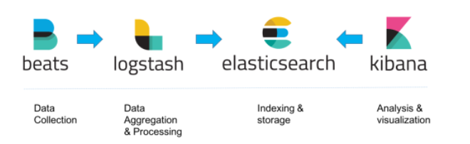

<h1 align="center">Tổng quan về ELK</h1>

## Mục lục
[Lời nói đầu](#loinoidau)

I.  [Technical Stack là gì ?](#technicalstack)

II. [Khái niệm về ELK Stack](#ELKstack)

III. [Thành Phần](#thanhphan)

IV. [Các trường hợp sử dụng ELK Stack](#sudung)

V. [Vì sao nên sử dụng ELK Stack](#visao)

<h3 align="center">-----------------------------------------</h3>

## Lời nói đầu

- Logging là công cụ đơn giản giúp đỡ ghi chép lại các hoạt động của hệ thống 
- Logging hỗ trợ kiểm tra trạng thái hoạt động của hệ thống diễn ra trong quá khứ, kiểm tra được hệ thống hoạt động như thế nào, từ đó hỗ trợ phát hiện tìm ra được nguyên nhân lỗi giúp cho việc fix lỗi trở nên dễ dàng hơn.
- Đối với các doanh nghiệp việc có thể tập trung logs để quản lý và theo dõi hệ thống rất phúc tạp và khó khăn. ELK Stack là một công cụ đơn giản và mạnh mẽ có thể sử dụng để quản lý logs một cách tập trung hoàn toàn miễn phí

## Phần I. Technical Stack là gì ?
- Technical Stack hay còn gọi là solution Stack, là tập hợp nhưng công nghệ/phần mềm phối hợp với nhau để có thể tạo ra một nên tàng có thể phối hợp với nhau để tạo ra một ứng dụng có thể hoạt động được.
- Đối với một Stack thường sẽ được cấu tạo bới các thành phần:
  - Hệ điều hành
  - Web Server
  - Database
  - back-end Programming language
- Mỗi thành phần trong stack đảm nhận các vai trò và nhiệm vụ riêng biết và không có sự trùng lặp.

Đọc thêm [tại đây](https://toidicodedao.com/2017/05/23/giai-thich-technical-stack-la-gi/)
## Phần II. Khái niệm về ELK Stack
- ELK Stack là tập hợp 3 phần mềm kết hợp làm việc chung với nhau, phục vụ cho công việc thu thập logging. 3 Phần mềm lần lượt là
  - Elasticsearch: Cơ sở dữ liệu lưu trữ và query log
  - Logtash: Tiếp nhận log từ nhiều nguồn sau đó xử lý và ghi log vào Elasticsearch
  - Kibana: Giao diện hỗ trợ quản lý, thống kê log. Hỗ trợ đọc thông tin từ Elasticsearch
  - Beats: Tập hợp các công cụ dùng để thu thập thông tin chuyên dụng. Có nhiệm vụ thu thập và vận chuyển dữ liệu từ client đến máy chủ ELK

-  ELK có điểm mạnh là khả năng thu thập và hiển thị log theo thời gian thực. Có thể đáp ứng truy vấn đến một lượng dữ liệu cực lớn

<h3 align="center"></h3>

- Cơ chế hoạt động của ELK Stack:

  1. Log sẽ được đưa đến Logstash thông qua nhiều tuyến đường. Ví dụ: Server gửi UDP request chứa log tới url của logtash hoặc Beat đọc file log và gửi lên Logstash
  2. Logstash sẽ đọc những log này, sau đó sẽ thêm một số thông tin về IP, thời gian, parse từ dữ liệu log (server, level cảnh báo,nội dung) sau đó thực hiện ghi log xuống database là Elasticsearch
  3. Sau đó kibana sẽ thực hiện đọc thông tin log từ Elasticsearch và hiển thị thông qua giao diện để người dùng có thể query và xử lý.

## Phần III. Thành Phần ELK Stack
### 3.1 Logstash
- Có chức năng phân tích cú pháp của các dòng dữ liệu, việc phân tích là cho dữ liệu ban đầu ở dạng khó đọc, không có dãn nhãn thành dữ liệu có cấu trúc và được dán nhãn.
- Khi cấu hình logstash luôn có 3 phần : Input, filter và Output
- Khi làm việc với logstash thường sẽ phải làm việc với filter nhiều nhất. Filter sử dụng Grok để thực hiện phân tích dữ liệu 

### 3.2 Elasticsearch
- ELK là một RESTful distributed search engine. Có thể hiểu là cung cấp khả năng tìm kiếm phân tán qua API. Sủ dụng kiểu lưu trữ dữ liệu noSQL( lưu trữ dữ liệu không cấu trúc)
- Elasticsearch cho phép tìm kiếm theo nhiều loại hình thức khác nhau: theo cấu trúc, phi cấu trúc, gieo metric theo cách mong muốn
- Elasticsearch rất nhanh, cho phép truy vấn lượng lớn dữ liệu tức thì với các dữ liệu đã thay đổi 
- Có thể thiết lập cài đặt vận hành trên hàng petabyte dữ liệu.
- Vận hành dễ dàng:
  - Có khả năng co giãn và tính sẵn sàng cao
  - Dự đoán trước, đáng tin cậy
  - Đơn giản, trong suôt
  - Elasticsearch sử dụng chuẩn RESTful APIs và JSON.B
## Phần IV. Các trường hợp sử dụng ELK Stack

- Đối với các hệ thống ứng dụng nhỏ, không cần dùng đến ELK mà sẽ sử dụng các thư viện ghi logs đi kèm ngôn ngữ rồi thực hiện ghi logs ra files và tiến hành đọc bình thường.
- Ở trường hợp đối với công ty có các hệ thống lớn với nhiều người dùng, có nhiều dịch vụ hoạt động cùng lúc dẫn đến việc ghi logs ra files không còn hiệu quả nữa. Vì số lượng thiết bị lớn nên không thể truy cập vào từng thiết bị để đọc từng files log mà cập quản lý tập trung để quản lý logs.ELK sẽ hỗ trợ xử lý vấn để đó.
## Phần V. Vì sao nên sử dụng ELK Stack

 - Đọc log từ nhiều nguồn: Logstash có thể đọc được log từ rất nhiều nguồn, từ log file cho đến log database cho đến UDP hay REST request.
 - Dễ tích hợp: Dù bạn có dùng Nginx hay Apache, dùng MSSQL, MongoDB hay Redis, Logstash đều có thể đọc hiểu và xử lý log của bạn nên việc tích hợp rất dễ dàng.
 - Hoàn toàn free: Chỉ cần tải về, setup và dùng, không tốn một đồng nào cả. Công ty tạo ra ELK Stack kiếm tiền bằng các dịch vụ cloud hoặc các sản phẩm premium phụ thêm.
 - Khả năng scale tốt: Logstash và Elasticsearch chạy trên nhiều node nên hệ thống ELK cực kì dễ scale. Khi có thêm service, thêm người dùng, muốn log nhiều hơn, bạn chỉ việc thêm node cho Logstash và Elasticsearch là xong.
 - Search và filter mạnh mẽ: Elasticsearch cho phép lưu trữ thông tin kiểu NoSQL, hỗ trợ luôn Full-Text Search nên việc query rất dễ dàng và mạnh mẽ.
 - Cộng đồng mạnh => tutorial nhiều => dễ dàng tiếp cận.

## Phần VI. Tài liệu tham khảo
- https://itnavi.com.vn/blog/elk-la-gi
- https://blog.cloud365.vn/logging/ELK-part1-tong-quan-ve-elk-stack/