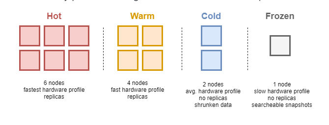

<h1 align="center">Elasticsearch Multi-Tier Architecture</h1>

# Phần I. Giới thiệu về kiến trúc hot-warm-cold-frozen
- Kiến trúc nhiều tầng cho phép Elasticsearch thực hiện tối ưu trong các trường hợp tìm kiếm. Các node thuộc cluster cần được tổ chức ở hình thưc pools đối với các node cần có cấu hình nhanh để đáp ứng nhu cầu thường xuyên tìm kiếm data, tiếp sau đó sẽ là nhiều cấu hình khác nhau kém mạnh mẽ hơn tùy thuộc yêu cầu sử dụng tìm kiếm hoặc ghi dữ liệu trên các node
- Với một số cấu hình thì số lượng node đối với mỗi tầng có thể không giống nhau
- Một data thường xuyên được truy vấn có thể được lưu trữ tại tầng có tỉ lệ sô node nhiều nhất và tốc độ nhanh nhất
- Không bắt buộc yêu cầu ở các tầng lưu trữ phải có cấu hình khác nhau, nhưng thường đối với tầng lưu trữ dữ liệu sử dụng thường xuyên sẽ có cấu hình manh và nhanh nhất.

- Elastisearh triển khai nhiều tầng sẽ có 3 tầng : hot, warm, cold, frozen và trong vòng đời lưu trữ dữ liệu sẽ lần lượt đi qua  3 tầng đó.
- Không yêu cầu cần triển một hệ thống Elasticsearc với đầy đủ các tầng trên. Đối với tầng hot là tầng ghi dữ liệu đầu vào của elasticsearch nên sẽ xuất hiện ở tất cả các trường hợp

<h3 align="center"></h3>

# Phần II. Multi-tier architecture

Tầng dữ liệu là tập hợp các node có chung đặc điểm về lưu trữ và sử dụng dữ liệu. Sự khác nhau ở đây chủ yếu đến từ tính khả dụng và phần cứng tài nguyên
Hiện nay đag có 5 node role đại diện cho các tầng dữ liệu:
- `Content tier`: Tầng hỗ trợ lập chỉ mục  và tìm kiếm nội dung các dữ liệu nhập vào
  - Tầng này lưu trữ nội dung dữ liệu không có sự thay đổi theo thời gian. Có thể thực hiện chuyển đến một tầng khác sau một thời gian nhất định. Thường xuyên thực hiện tối ưu hóa trong các trường hợp không lập chỉ mục chuyên sâu như là dữ liệu về chuỗi thời gian. Đây là tầng bắt buộc vì dữ lieuj cần lập chỉ mục thì phải đi qua nó
- `Hot tier`: đây là tầng thực hiện xử lý các index theo dòng thời gian của log hay metrics và thục hiện giữ lại, lưu trữ các dữ liệu sử dụng thường xuyên
  - 