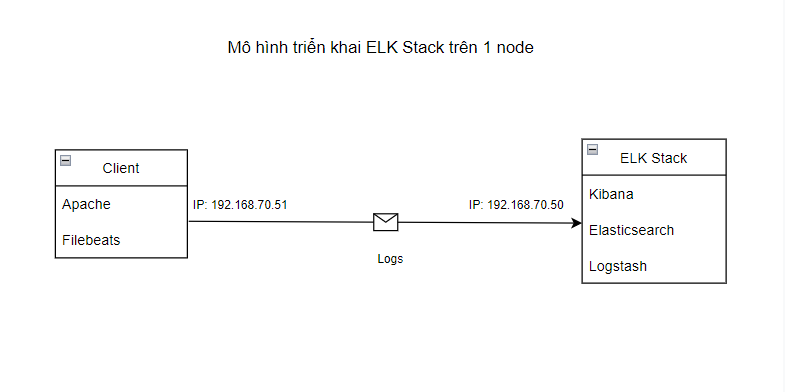
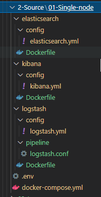
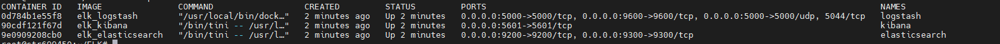
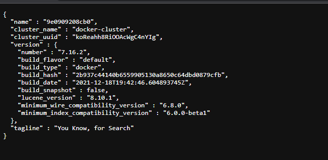
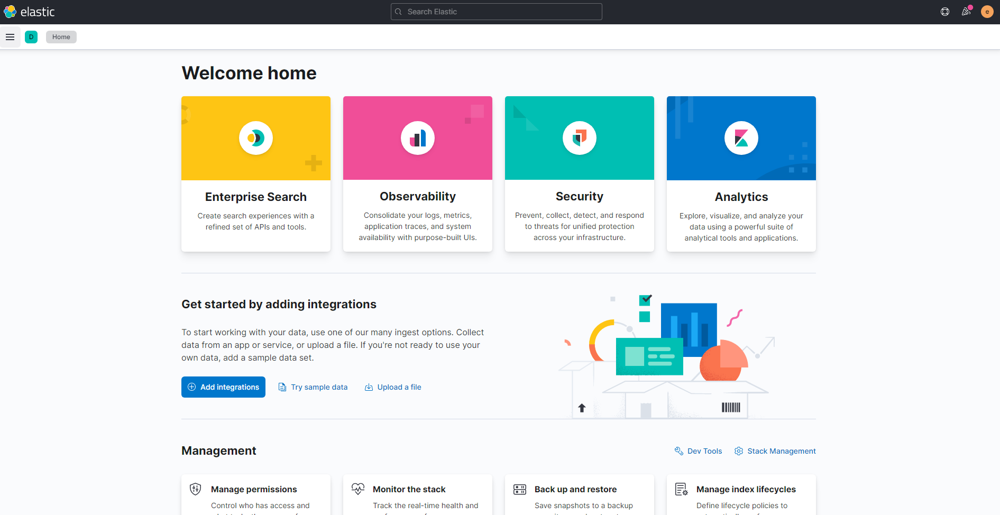

<h1 align="center">Tài liệu hướng dẫn cài đặt ELK Stack sử dụng Docker-compose</h1>

## Mục lục
I. [Chuẩn bị](#chuanbi)

II. [Cài đặt ELK Stack](#installelk)

III. [Cài đặt Beats trên client](#installbeats)

IV. [Cấu hình hiển thị Logs trên Kibana](#showlogkibana)


<h3 align="center">-----------------------------------------</h3>

## Phần I. <a name="chuanbi"></a>Chuẩn bị

<h3 align="center"></h3>

Mô hình triển khai bao gồm các thảnh phần:
- 1 máy chủ cài đặt ELK Stack:
  - OS: Ubuntu 20.04.3
  - Ram: 4GB
  - CPU: 6GB
  - Disk: 100GB
  - Network: 192.168.70.50 
- 1 Client:
  - OS: Centos 7
  - Ram: 4GB
  - CPU: 2 CPU
  - Disk: 50GB
  - Network: 192.168.70.51

## Phần II. <a name="installelk"></a>Cài đặt ELK Stack
- Để cài máy chủ ELK trước tiên cần thực hiện cài đặt Docker-Compose sau đó sẽ thực hiện cài đặt và cấu hình các thành phần Logstash,Elastcisearch,kibana thông qua `Docker-Compose.yml`
### 1. Cài đặt Docker-Compose
- Thực hiện update OS:
```sh
sudo apt-get update -y
```
- Cài đặt các gói ràng buộc
```sh
sudo apt-get install apt-transport-https ca-certificates curl software-properties-common
```
- Adding Docker’s GPG Key

```sh
curl -fsSL https://download.docker.com/linux/ubuntu/gpg | sudo apt-key add -
```

- Cài đặt Docker
```sh
sudo add-apt-repository "deb [arch=amd64] https://download.docker.com/linux/ubuntu  $(lsb_release -cs)  stable"
sudo apt update
sudo apt-get install docker-ce
```
- Kiểm tra version docker cài đặt:
```sh
docker --version
kết quả:
Docker version 20.10.16, build aa7e414
```
- kiểm tra version docker compose
```sh
$ apt-cache madison docker-compose-plugin
docker-compose-plugin | 2.5.0~ubuntu-focal | https://download.docker.com/linux/ubuntu focal/stable amd64 Packages
docker-compose-plugin | 2.3.3~ubuntu-focal | https://download.docker.com/linux/ubuntu focal/stable amd64 Packages
```
- cài đặt docker compose version 2.5.0
```sh
$ sudo apt-get install docker-compose-plugin=2.5.0~ubuntu-focal
```
- Kiểm tra phiên bản docker compose sau khi cài đặt
```sh
$  docker compose version
Docker Compose version v2.5.0
```

### 2. Cài đặt ELK Stack
- Cấu trúc thư mục cài đặt ELK Stack trên Docker Compose

<h3 align="center"></h3>

#### **Tạo file Config hỗ trợ setup**
Khởi tạo files setup và config trên các stack theo các nội dung sau đây:
- .env: là một biến môi trường khi sử dụng file cấu hình cài đặt docker-compose.yml. Nội dung trong file đảm bảo version cho elasticsearch,kibana,logstash được cài đặt theo ý muốn

Nội dung file:
```sh
STACK_VERSION=7.16.2
```

- Elastcsearch:

Dockerfie: file chỉ định version cài đặt Elastcsearch
```sh
ARG ELK_VERSION

# https://www.docker.elastic.co/
FROM docker.elastic.co/elasticsearch/elasticsearch:${ELK_VERSION}

# Add your elasticsearch plugins setup here
# Example: RUN elasticsearch-plugin install analysis-icu
```

elasticsearch.yml: File cấu hình cơ bản sử dụng elasticsearch 
```sh
---
## Default Elasticsearch configuration from Elasticsearch base image.
## https://github.com/elastic/elasticsearch/blob/master/distribution/docker/src/docker/config/elasticsearch.yml
#
cluster.name: "docker-cluster"
network.host: 0.0.0.0

## X-Pack settings
## see https://www.elastic.co/guide/en/elasticsearch/reference/current/setup-xpack.html
#
# xpack.license.self_generated.type: trial 
xpack.security.enabled: true
xpack.monitoring.collection.enabled: true
```
- Logstash:

Dockerfie: file chỉ định version cài đặt Logstash trên Docker
```sh
ARG ELK_VERSION

# https://www.docker.elastic.co/
FROM docker.elastic.co/logstash/logstash:${ELK_VERSION}

# Add your logstash plugins setup here
# Example: RUN logstash-plugin install logstash-filter-json
```
logstash.yml: File cấu hình cơ bản sử dụng Logstash
```sh
---
## Default Logstash configuration from Logstash base image.
## https://github.com/elastic/logstash/blob/master/docker/data/logstash/config/logstash-full.yml
#
http.host: "0.0.0.0"
xpack.monitoring.elasticsearch.hosts: [ "http://elasticsearch:9200" ]

## X-Pack security credentials
#
xpack.monitoring.enabled: true
xpack.monitoring.elasticsearch.username: monitor_elastic
xpack.monitoring.elasticsearch.password: Passwordelastic
```

logstash.conf : File cấu hình gửi dữ liệu sau khi đã xử lý đến OUTPUT ( ở đây đang cấu hình gửi dữ liệu đến elasticsearch)
```sh
input {
        tcp {
                port => 5000
        }
}

## Add your filters / logstash plugins configuration here

output {
        elasticsearch {
                hosts => "elasticsearch:9200"
                user => "elastic"
                password => "Password2022"
        }
}
```

- Kibana:

Dockerfile: file chỉ định version cài đặt Logstash trên Docker
```sh
ARG ELK_VERSION

# https://www.docker.elastic.co/
FROM docker.elastic.co/kibana/kibana:${ELK_VERSION}

# Add your kibana plugins setup here
# Example: RUN kibana-plugin install <name|url>
```

kibana.yml: File cấu hình cơ bản sử dụng kibana
```sh

---
## Default Kibana configuration from Kibana base image.
## https://github.com/elastic/kibana/blob/master/src/dev/build/tasks/os_packages/docker_generator/templates/kibana_yml.template.js
#
server.name: kibana
server.host: "0"
elasticsearch.hosts: [ "http://elasticsearch:9200" ]
xpack.monitoring.ui.container.elasticsearch.enabled: true

## X-Pack security credentials
#
elasticsearch.username: elastic
elasticsearch.password: password
```

#### **Tạo file setup Docker-compose**
- Nội Dung file Docker-compose.yml
```sh
version: '3.3'  //Phiên bản Docker compose

services:
  elasticsearch:
    build:
      context: elasticsearch/
      args:
        ELK_VERSION: $ELK_VERSION
    container_name: elasticsearch
    volumes:
      - type: bind
        source: ./elasticsearch/config/elasticsearch.yml
        target: /usr/share/elasticsearch/config/elasticsearch.yml
        read_only: true
      - type: volume
        source: elasticsearch
        target: /usr/share/elasticsearch/data
    ports:
      - "9200:9200"
      - "9300:9300"
    environment:
      ES_JAVA_OPTS: "-Xmx256m -Xms256m"
      ELASTIC_PASSWORD: password
      # Use single node discovery in order to disable production mode and avoid bootstrap checks
      # see https://www.elastic.co/guide/en/elasticsearch/reference/current/bootstrap-checks.html
      discovery.type: single-node
    networks:
      - elk

  logstash:
    build:
      context: logstash/
      args:
        ELK_VERSION: $ELK_VERSION
    container_name: logstash
    volumes:
      - type: bind
        source: ./logstash/config/logstash.yml
        target: /usr/share/logstash/config/logstash.yml
        read_only: true
      - type: bind
        source: ./logstash/pipeline
        target: /usr/share/logstash/pipeline
        read_only: true
    ports:
      - "5000:5000/tcp"
      - "5000:5000/udp"
      - "9600:9600"
    environment:
      LS_JAVA_OPTS: "-Xmx256m -Xms256m"
    networks:
      - elk
    depends_on:
      - elasticsearch

  kibana:
    build:
      context: kibana/
      args:
        ELK_VERSION: $ELK_VERSION
    container_name: kibana
    volumes:
      - type: bind
        source: ./kibana/config/kibana.yml
        target: /usr/share/kibana/config/kibana.yml
        read_only: true
    ports:
      - "5601:5601"
    networks:
      - elk
    depends_on:
      - elasticsearch

networks:
  elk:
    driver: bridge

volumes:
  elasticsearch:
```

- Sau khi hoàn thành khởi tạo các file config và setup, tiến hành triển khai docker-compose để cài đặt ELK Stack
```sh
$ docker compose up -d
[+] Running 4/4
 ⠿ Network elk_elk          Created                   0.3s
 ⠿ Container elasticsearch  Started                   1.5s
 ⠿ Container logstash       Started                   2.5s
 ⠿ Container kibana         Started                   2.5s
```
- Sau khi Docker Compose hoàn thành cài đặt thì kiểm tra một số thành phần như sau:
  - Kiểm tra trạng thái hoạt động của các Container
  <h3 align="center"></h3>
  
  - kiểm tra trạng thái hoạt động của Elasticsearch trên trình duyệt thông qua Port 9200
  <h3 align="center"></h3>
  - kiểm tra trạng thái hoạt động của kibana trên trình duyệt thông qua Port 5601
  <h3 align="center"></h3>