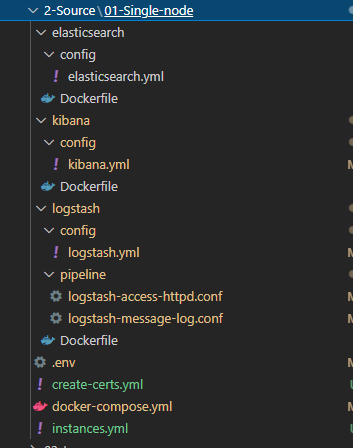
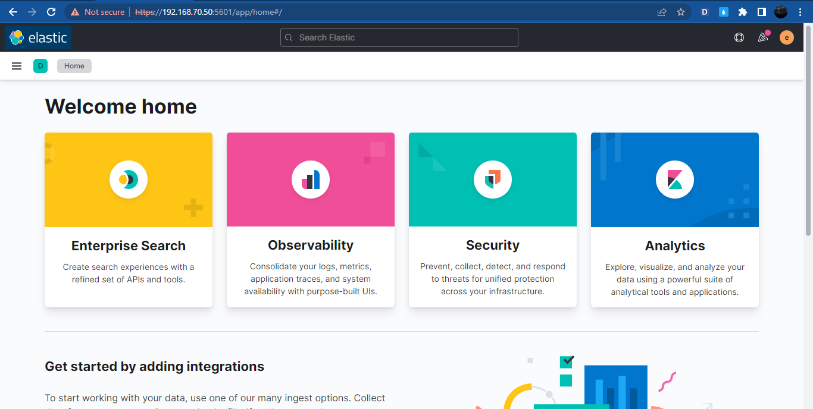

<h1 align="center">Tài liệu hướng dẫn cài đặt ELK Stack sử dụng Docker-compose</h1>

## Mục lục
I. [Chuẩn bị](#chuanbi)

II. [Cài đặt ELK Stack](#installelk)

III. [Cài đặt Beats trên client](#installbeats)

IV. [Cấu hình hiển thị Logs trên Kibana](#showlogkibana)


<h3 align="center">-----------------------------------------</h3>

## Phần I. <a name="chuanbi"></a>Chuẩn bị

<h3 align="center"></h3>

Mô hình triển khai bao gồm các thảnh phần:
- 1 máy chủ cài đặt ELK Stack:
  - OS: Ubuntu 20.04.3
  - Ram: 4GB
  - CPU: 6GB
  - Disk: 100GB
  - Network: 192.168.70.50 
- 1 Client:
  - OS: Centos 7
  - Ram: 4GB
  - CPU: 2 CPU
  - Disk: 50GB
  - Network: 192.168.70.51

## Phần II. <a name="installelk"></a>Cài đặt ELK Stack trên Ubintu 20.04
- Cài máy chủ ELK trên 1 node, sẽ thực hiện cài đặt thông qua docker để tối ưu quá trình cài đặt. Trước tiên cần thực hiện cài đặt Docker-Compose sau đó sẽ thực hiện cài đặt và cấu hình các thành phần Logstash,Elastcisearch,kibana thông qua `Docker-Compose.yml`
### 1. Cài đặt Docker-Compose
- Thực hiện update OS:
```sh
sudo apt-get update -y
```
- Cài đặt các gói ràng buộc
```sh
sudo apt-get install -y apt-transport-https ca-certificates curl software-properties-common
```
- Adding Docker’s GPG Key

```sh
curl -fsSL https://download.docker.com/linux/ubuntu/gpg | sudo apt-key add -
```

- Cài đặt Docker
```sh
sudo add-apt-repository "deb [arch=amd64] https://download.docker.com/linux/ubuntu  $(lsb_release -cs)  stable"
sudo apt update
sudo apt-get install docker-ce -y
```
- Kiểm tra version docker cài đặt:
```sh
docker --version
kết quả:
Docker version 20.10.16, build aa7e414
```
- kiểm tra version docker compose sẽ thực hiện cài đặt
```sh
$ apt-cache madison docker-compose-plugin
docker-compose-plugin | 2.5.0~ubuntu-focal | https://download.docker.com/linux/ubuntu focal/stable amd64 Packages
docker-compose-plugin | 2.3.3~ubuntu-focal | https://download.docker.com/linux/ubuntu focal/stable amd64 Packages
```
- cài đặt docker compose version 2.5.0
```sh
sudo apt-get install docker-compose-plugin=2.5.0~ubuntu-focal
```
- Kiểm tra phiên bản docker compose sau khi cài đặt
```sh
$  docker compose version
Docker Compose version v2.5.0
```

### 2. Cài đặt ELK Stack
- Cấu trúc thư mục cài đặt ELK Stack trên Docker Compose

<h3 align="center"></h3>

Trong đó:
  - `*.yml`: Các file có định dạng .yml là những file cấu hình của các phần mêm elaticsearch,logstash,kibana sử dụng cấu trúc ngôn ngũ yaml
  - `Dockerfile`: file cấu hình xác định đường dẫn cài đặt các image trên docker
  - `.env`: Sử dụng để khai báo các biến và giá trị sử dụng phụ vụ cho quá trình cài đặt
  - `create-certs.yml`: file cấu hình cài đặt Container thực hiện tạo certs cho hệ thống EL Stack
  - `instance.yml`: file thống tin tên và địa chỉ các node phục vụ cấu cho quá trình tạo certs
  - `docker-compose.yml`: file setup thực hiện cài đặt ELK Stack chưa nội dung về các về việc khởi tạo và cài đặt các container trên docker phục vụ cho ELK Stack.

File cài đặt và cấu hình được đặt [tại đây](https://github.com/thang290298/Ghi-chep-Logs/tree/main/ELK-Stack/2-Source/01-Single-node)

**`Bước 1`**: Thực hiện tạo các file cài đặt theo nội dung các file bên trên hoặc download
**`Bước 2`**: thực hện khởi tạo certs cho hệ thống
- Thực hiện các câu lệnh:
```sh
docker-compose -f create-certs.yml run --rm create_certs
```
- Sau khi thực hiện câu lệnh này hệ thống sẽ tiến hành đọc file create-certs.yml, sau khi hoàn thành tạo ra cert thì docker sẽ tiến hành xóa container có tên `create_certs` đã được tạo ra sau khi thực thi fie `create-certs.yml`
- kết quả trả về: Tạo Certs thành công
```sh
creating: /certs/ca/
  inflating: /certs/ca/ca.crt        
   creating: /certs/elasticsearch/
  inflating: /certs/elasticsearch/elasticsearch.crt  
  inflating: /certs/elasticsearch/elasticsearch.key
```
> Lưu ý:
>   - Nếu trường hợp khởi tạo Cert lỗi hệ thống sẽ trả thông báo lỗi ra màn hình
>  - Trong trường hợp hệ thống không trả về kết quả cũng nhưng thông báo lỗi tức là file certs đã được tạo ra trước đó, cần kiểm tra lại

**`Bước 3`**: Thực hiện cài đặt ELK Stack
- Thực hiện câu lệnh:
```sh
docker compose up -d
```
- Trong đó: 
  - `docker compose up`: chạy file docker-compose.yml và thực thi các giá trị đã cấu hình bên trong
  - `-d`: Docker compose thực hiện chạy nền, không hiển thị quá trình cài đặt và log ra màn hình

- Trong trường hợp cần tắt và xóa các container
```sh
docker compose down
```
- Sau khi hoàn thành khởi tạo các file config và setup, tiến hành triển khai docker-compose để cài đặt ELK Stack
```sh
$ docker compose up -d
[+] Running 4/4
 ⠿ Network elk_elk          Created                   0.3s
 ⠿ Container elasticsearch  Started                   1.5s
 ⠿ Container logstash       Started                   2.5s
 ⠿ Container kibana         Started                   2.5s
```
- Sau khi Docker Compose hoàn thành cài đặt thì kiểm tra một số thành phần như sau:
  - Kiểm tra trạng thái hoạt động của các Container
  <h3 align="center"></h3>
  
  - kiểm tra trạng thái hoạt động của Elasticsearch trên trình duyệt thông qua Port 9200
  <h3 align="center"></h3>
  - kiểm tra trạng thái hoạt động của kibana trên trình duyệt thông qua Port 5601
  <h3 align="center"></h3>

## Phần III. <a name="installbeats"></a>Cài đặt Beats/filebeat trên client ( Centos)
- Thực hiện cài đặt `beats` vận chuyện log Filebeat trên các thiết bị linux bao gồm các phần:
  - Thực hiện cài đặt Filebeat trên các thiết bị cần theo dõi
  - Chỉ định vị trí của file log
  - Phân tích và gửi dữ liệu log đến 

### 1. Cài đặt
- thực hiện tải và cài đặt filebeat version theo câu lệnh sau đây:
```sh
curl -L -O https://artifacts.elastic.co/downloads/beats/filebeat/filebeat-7.16.2-x86_64.rpm
sudo rpm -vi filebeat-7.16.2-x86_64.rpm
```
### 2. Cấu hình kết nối đến Logstash

- Chỉnh sửa các nội dung trong file: `/etc/filebeat/filebeat.yml`
  - Filebeat inputs
  ```sh
  filebeat.inputs:
  - type: log
    enabled: true
    paths:
      - /var/log/httpd/*.log
    tags: ["access_log"]

  - type: log
    enabled: true
    paths:
      - /var/log/message
   tags: ["message_log"]

  ```
  - Logstash Output : thực hiện bỏ # và điền thông tin kết nối đến Logstash
  ```sh
  - Trước:
  #output.logstash:
  # The Logstash hosts
  #hosts: ["localhost:5044"]
  - Sau:
  output.logstash:
  # The Logstash hosts
  hosts: ["192.168.70.50:5000"]
  
- Cấu hình thu thập log
  - list danh sách module đang được hỗ trợ
  ```sh
  [root@thangnv-client1 httpd]# filebeat modules list
  Enabled: // module đã kích hoạt
  apache
  system
  
  Disabled: // list Modele được hỗ trợ
  apache
  auditd
  elasticsearch
  haproxy
  icinga
  iis
  kafka
  kibana
  logstash
  mongodb
  mysql
  nats
  nginx
  osquery
  pensando
  postgresql
  redis
  santa
  system
  traefik
  [root@thangnv-client1 httpd]#
  ```
  - Thực hiện kích hoạt Module
  ```sh
  filebeat modules enable {Module}
  - ví dụ:
  filebeat modules enable apache
  ```
  - Chỉnh sửa nội dung file cấu hình Module có đường dẫn : `/etc/filebeat/modules.d`
  ```sh
  - module: apache  // Tên Modue
  # Access logs
  access:
    enabled: true  // bật tính năng thu thập access log
    var.paths: ["/var/log/httpd/access_log*"]  //Đường dẫn file log access

  # Error logs
  error:
    enabled: true  // bật tính năng thu thập error log
    var.paths: ["/var/log/httpd/error_log*"]  // Đường dẫn file log error
  ```

- Thực hiện thiết lập và chỉnh sửa các cấu hình vừa thay đổi
```
filebeat setup -e
```
trong đó: -e là tùy chọn hiển thị hiển thì lỗi setup ra màn hình thay vì hiển thị trong file cấu hình

- Kích hoạt dịch vụ filebeat
```sh
systemctl enable filebeat
systemctl start filebeat
```

## Phần IV. <a name="showlogkibana"></a>Cấu hình hiển thị Logs trên Kibana

- Truy cập địa chỉ IP kibana theo IP của ELK, ví dụ: http://192.168.70.50:5601, chọn `Discover` trong `Index Management` của `Elasticsearch`. Ở đây bạn sẽ thấy các index có tiền tố là filebeat, chính là các index lưu dữ liệu log do Filebeat gửi đến Logstash và Logstash để chuyển lưu tại Elasticsearch.

<h3 align="center"></h3>

- Để truy vấn bằng Kibana ta sẽ tạo các Index patterns, đó là truy vấn thông tin các index có tiền tố là filebeat-, nhấn vào Index patterns của Kibana, bấm vào Create index pattern

- Điền `filebeat-*` vào `index pattern`, rồi nhấn Next Step
- Chọn `@timestamp` ở mục Time Filter field name, rồi nhấn Create Index Pattern
- Cuối cùng, bấm vào `Discover`, để xem thông tin về các `log`. Mặc định đang liệt các log 15 phút cuối

<h3 align="center"></h3>