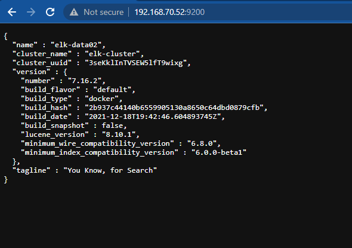

<h1 align="center">Tài liệu xây dựng hệ thống ELK-Stack Cluster cơ bản </h1>

# Phần I. Tổng quan
## 1. Mô hình hệ thống
- Mô hình luồng xử lý dữ liệu


<h3 align="center"></h3>


- Mô hình triển khai
<h3 align="center"></h3>


## 2. Thành phần chức năng
- Node 1:
  - Hosname: elk-master01
  - Cấu hình: 4CPU, 6GB Ram
  - IP: 192.168.70.51 (IP Public), 10.10.10.21 (IP Private), 127.0.0.1 (IP local)
| <p align="center">Node</p> | <p align="center">Host name</p> | <p align="center">role</p> | <p align="center">Cấu hình</p> | <p align="center">Vai trò</p> |
|------|-----------|------|----------|-----------|
| Master-01 | ELK-Master | <ul><li>master</li><li>voting_only</li></ul> | <ul><li></li></ul> | <ul><li>Có trách nhiệm quản lý, tạo, sửa, xóa index, tái sắp xếp shard, thêm hoặc xóa 1 node ra khỏi cụm cluster</li><li>Chỉ định nút có đủ điều kiệu lên làm master trong cụm cluster đã được khai báo </li></ul> |
| Data1 | ELK-Data1 | <ul><li>data_hot</li><li>data_content<li>master</li></ul> | <ul><li></li></ul> | <ul><li>Sử dụng để lưu trữ dữ liệu vửa được đẩy vào từ logstash và có lượng tìm kiếm lớn</li><li>Sử dụng backup dự phòng cho node master </li></ul> ||  |
| Data2 | ELK-Data2 | <ul><li>data_warm</li><li>data_cold</li><li>data_frozen<li>master</li></ul>| <ul><li> </li></ul> | <ul><li>Lưu trữ dữ liệu ít được tìm kiếm</li><li>Sử dụng backup dự phòng cho node master </li></ul> |
| Ingest | ELK-Ingest | <ul><li>Ingest</li></ul> | <ul><li></li></ul> | <ul><li> Xử lý dữ documents trước khi quán trình index bắt đầu  </li></ul> |
| Coordinating | ELK-Coordinating | <ul><li>[ ]</li></ul> | <ul><li></li></ul> | <ul><li>Có trach nhiệm điều phối, xử lý các request</li></ul> |
| Transform | ELK-Transform  | <ul><li>transform</li><li>remote_cluster_client</li></ul> | <ul><li></li></ul> | <ul><li>thực hiện chuyển đổi các chỉ số Elasticsearch và các chỉ số API </li></ul> |
| Machine-learning | ELK-Machine-learning | <ul><li>ml</li><li>remote_cluster_client</li></ul>| <ul><li></li></ul> | <ul><li>Xử lý các tiến trình API requests</li></ul>|


# Phần II. Triển khai cài đặt
## 1. Cài đặt chug trên tất cả các node ELK-Stack
### Thực hiện cài đặt Docker Compose
- Thực hiện update OS:
```sh
sudo apt-get update -y
```
- Cài đặt các gói ràng buộc
```sh
sudo apt-get install -y apt-transport-https ca-certificates curl software-properties-common
```
- Adding Docker’s GPG Key

```sh
curl -fsSL https://download.docker.com/linux/ubuntu/gpg | sudo apt-key add -
```

- Cài đặt Docker
```sh
sudo add-apt-repository "deb [arch=amd64] https://download.docker.com/linux/ubuntu  $(lsb_release -cs)  stable"
sudo apt update
sudo apt-get install docker-ce -y
```
- Kiểm tra version docker cài đặt:
```sh
docker --version
kết quả:
Docker version 20.10.16, build aa7e414
```
- Cài đặt Docker Compose
```sh
apt-get install docker-compose -y
```
- kiểm tra version docker compose sẽ thực hiện cài đặt
```sh
$ apt-cache madison docker-compose-plugin
docker-compose-plugin | 2.5.0~ubuntu-focal | https://download.docker.com/linux/ubuntu focal/stable amd64 Packages
docker-compose-plugin | 2.3.3~ubuntu-focal | https://download.docker.com/linux/ubuntu focal/stable amd64 Packages
```
- cài đặt docker compose version 2.5.0
```sh
sudo apt-get install docker-compose-plugin=2.5.0~ubuntu-focal
```
- Kiểm tra phiên bản docker compose sau khi cài đặt
```sh
$  docker compose version
Docker Compose version v2.5.0
```
### Điểu chỉnh bộ nhớ ảo
Điều chỉnh số lượng mmap để tránh trường hợp hết bộ nhớ ảo
- cập nhật thông số trong file: `/etc/sysctl.conf`
```sh
echo "vm.max_map_count=262144" >> /etc/sysctl.conf
```
- kiểm tra lại:
```sh
sysctl -p
```

### Tăng giới hạn mô tả file đang mở
- Thay đổi giá trị trong file `/etc/security/limits.conf`
```sh
echo "- nofile 65536" >> /etc/security/limits.conf
```
### Cập nhật thông tin các node trong file host
```sh
echo "# list node ELK
192.168.70.51 elk-master
192.168.70.52 elk-data1
192.168.70.53 elk-data2
192.168.70.54 elk-data3
192.168.70.55 elk-ingest
192.168.70.56 elk-cordinating
192.168.70.57 elk-transform
192.168.70.58 elk-machine-learning
192.168.70.59 logstash
192.168.70.60 kibana
192.168.70.61 elk-remote
" >> /etc/hosts
```
## 2. Thực hiện trên các node Elasticsreach
### **`2.1 Node Master`**
### - Allow Port firewalld
```sh
sudo ufw allow 9200
sudo ufw allow 9300
```
### - Tạo thư mục
- Thư mục lưu trữ data
```sh
mkdir -p /elasticsearchdb-master
```
- Thư mục chứa các file cấu hình và setup cho node-master
```sh
mkdir -p /node-master
cd /node-master
```

### - Tạo Certs certificate SSL sử trên tất cả các node
Bước 1: 
- Tạo file `.env` chưa thông tin về path, version, password,port dử dụng cho cài đặt
  - Nội dung file :
```sh
# Phiên bản ELK Stack sử dụng để cài đặt
ELK_VERSION=7.16.2
# Đường dẫn lưu trữu chúng chỉ SSL sau khi khởi tạo
CERTS_DIR=/usr/share/elasticsearch/config/certificates
# Password user elastic sử dụng đăng nhập elasticsearch và kibana
password_elasticsearch=Password2022
```
Bước 2:
- Khởi tạo file `instances.yml` chứ thông tin tên và IP các node trong cum. 
  - Nội dùng file:
```sh
instances:
  - name: elk-luster
    dns:
	  - localhost
      - elk-master
	  - elk-data1
	  - elk-data2
	  - elk-data3
	  - elk-ingest
	  - elk-cordinating
	  - elk-transform
	  - elk-machine-learning
   	  - elk-remote
 	  - logstash
	  - kibana
    ip:
      - 127.0.0.1
      - 192.168.70.51
      - 192.168.70.52
      - 192.168.70.53
	  - 192.168.70.54
	  - 192.168.70.55
	  - 192.168.70.56
  	  - 192.168.70.57
	  - 192.168.70.58
   	  - 192.168.70.59
  	  - 192.168.70.60
  	  - 192.168.70.61
```
Bước 3:
- Chuẩn bị file docker-compose thực hiện khởi tạo Container phục vụ cho việc tại chứng chỉ SSL hoạt động trên các node
  - Nội dung file `create-certs.yml`
```sh
version: '2.2'

services:
  create_certs:
    container_name: create_certs
    image: docker.elastic.co/elasticsearch/elasticsearch:${ELK_VERSION}
    command: >
      bash -c '
        if [[ ! -f /certs/bundle.zip ]]; then
          bin/elasticsearch-certutil cert --silent --pem --in config/certificates/instances.yml -out /certs/bundle.zip;
          unzip /certs/bundle.zip -d /certs;
        fi;
        chown -R 1000:0 /certs
      '
    user: "0"
    working_dir: /usr/share/elasticsearch
    volumes: ['certs:/certs', '.:${CERTS_DIR}']

volumes: {"certs"}
```
Bước 4:
- Thực hiện khởi tạo chứng chỉ SSL
```sh
docker-compose -f create-certs.yml run --rm create_certs
```
Kết quả:
```sh
Archive:  /certs/bundle.zip
   creating: /certs/ca/
  inflating: /certs/ca/ca.crt
   creating: /certs/elk-luster/
  inflating: /certs/elk-luster/elk-luster.crt
  inflating: /certs/elk-luster/elk-luster.key
```
> Lưu ý: 
>  - sau khi Chứng chỉ `SSL` khởi tạo công SSL thì Container create_certs sẽ bị xóa bởi option `--rm create_certs`
>  - Chứng chỉ được lưu tại đường dẫn trên server: `/var/lib/docker/volumes/node-master-certs/_data/`

### - Cài đặt Elasticsearch
- Đứng tại thư mực `node-master` tạo file cấu hình và setup

Bước 1: Tạo file setup `docker-compose.yml` 
  - Nội dung file [tại đây]()
> Lưu ý: do file `.env` đã tạo trong quá trình tạo SSL nên các biến trong file `docker-compose.yml` sẽ đọc giá trị từ file `.env` do cùng nằm trong 1 thư mục.

Bước 2: Tạo file config `elasticsearch-master.yml` sử dụng cho elasticsearch
  - Nội dung file [tại đây]()

Bước 3: Thực hiện setup
```sh
docker compose up -d
```
Bước 4: kiểm tra kết quả:
<h3 align="center"></h3>

