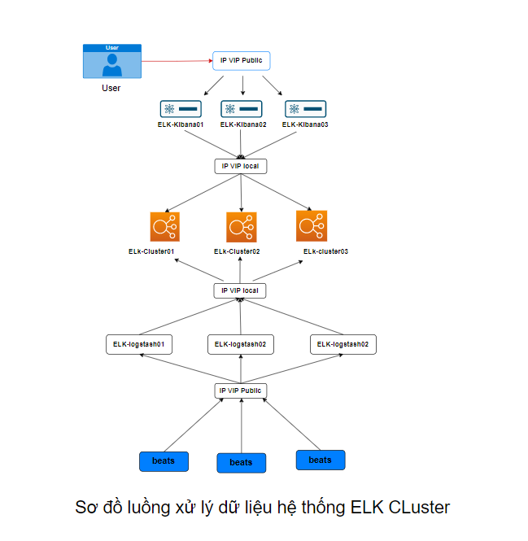
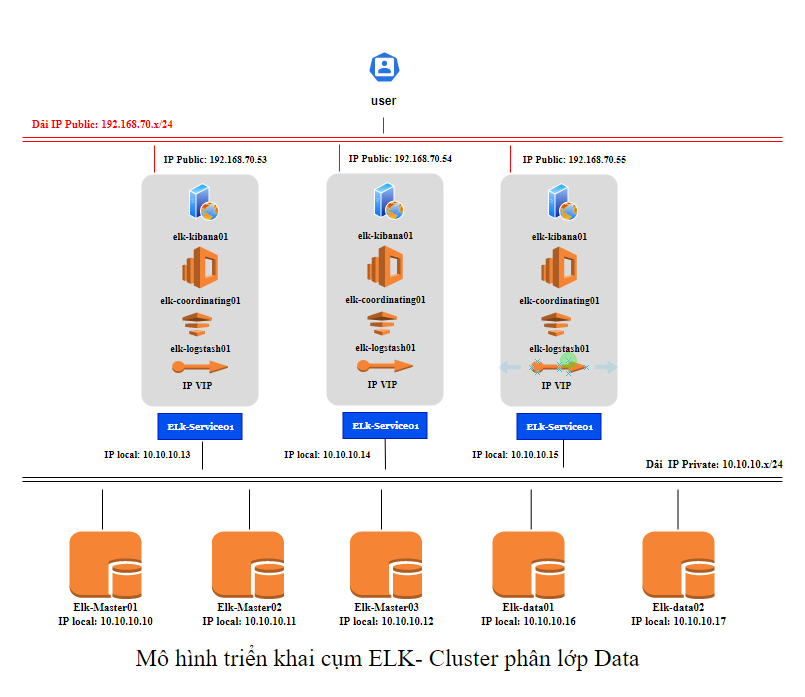
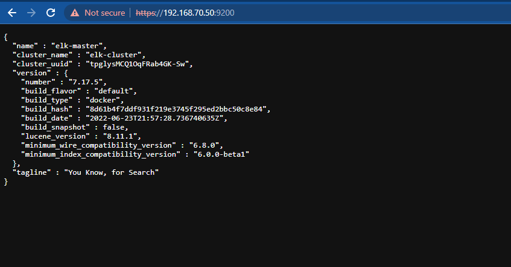

<h1 align="center">Tài liệu xây dựng hệ thống ELK-Stack Cluster cơ bản </h1>

# Phần I. Tổng quan
## 1. Mô hình hệ thống
### -  Mô hình luồng xử lý dữ liệu


<h3 align="center"></h3>

- Mội thành phần xử lý dữ liệu hay điều hướng các request đều được hoạt động dưới hình thức HA nhằm mục đích đảm bảo tính ổn định, tăng hiệu năng xử lý của hệ thống.

- Để có thể kết nối đến các thành phần trong một cụm sẽ sử dụng IP VIP để thực hiện kết nối và chia tải hệ thống


### -  Mô hình triển khai thiết bị vật lý
<h3 align="center"></h3>

- Đối với mô hình nêu trên cần đến 7 server sử dụng docker để thực hiện cài đặt cụm ELK cluster, Túy thuộc vào tài nguyên hệ thống mà có thể đặt các role hoặc tăng giảm số container  cho các node thuộc Cluster nhằm mục đích giảm thiếu hoặc tăng số lượng server:
- Quý tắc đăt roles cho cụm `Elastcisearch`:
  - Tối thiểu 1 cụm cần có các thành phần: Master, Data, ingest, coordinating
  - Cần thực hiện chạy Cluster đối với các role
  - Trên một server vật lý cài đặt Elasticsearch có thể thực hiện đặt nhiều role khác nhau dẫn điến một cụm ELK-cluster có thể có số server chẵn nhưng số lượng server sử dụng cho 1 role luôn lẻ nhằm thỏa mãn công thức về số node hoạt động là (N/2)+1

- VLan:
  - Pubic 192.168.70..x/24: Sử dụng để management các server, tiếp nhận dữ liệu đẩy vào và đua dữ liệu ra bên ngoài thông qua kibana đến với người dùng
  - Prvate 10.10.10.x/24: Sủ dụng để các node trong hệ thống thưc hiện giao tiếp và xử lý dữ liệu 

## 2. Thành phần chức năng các node có trong mô hình

### `Node ELK-Master`
- Hosname: elk-master
- IP Public: 192.168.70.50/24
- IP Private: 10.10.10.10/24
- Container: Elasticsearch
- Role: master, ml, transform
- Chức năng: Xủ lý, sửa , xóa các index. Add thêm hoặc xóa node trong cụm, thực hiện tìm kiếm và chuyển đổi các API gửi đến hệ thống
 - Tại một thời điểm chỉ có một node master hoạt động

### `Node ELK-data1`
- Hosname: elk-data1
- IP Public: 192.168.70.51/24
- IP Private: 10.10.10.11/24
- Container: Elasticsearch
- Role: data, master, ingest
- Chức năng: Xử lý dữ liệu index trước khi lưu trữ , lưu trữ dữ liệu, thực hiện backup roles master để khi cần thiết có thể đứng lên làm master

### `Node ELK-data2`
- Hosname: elk-data2
- IP Public: 192.168.70.52/24
- IP Private: 10.10.10.12/24
- Container: Elasticsearch
- Role: data, master, ingest, voting_only
- Chức năng: Xử lý dữ liệu index trước khi lưu trữ , lưu trữ dữ liệu, thực hiện backup roles master để khi cần thiết có thể đứng lên làm master, khả năng đúng tổ chức bình chọn node master khi node master hiện tại gặp sự cố không hoạt động

### `Node ELK-data3`
- Hosname: elk-data3
- IP Public: 192.168.70.53/24
- IP Private: 10.10.10.13/24
- Container: Elasticsearch
- Role: data, ingest,
- Chức năng: Xử lý dữ liệu index trước khi lưu trữ , lưu trữ dữ liệu

### `Node ELK-service01`
- Hosname: elk-data3
- IP Public: 192.168.70.54/24
- IP Private: 10.10.10.14/24
- Container1: Elasticsearch
  - Role: coordinating
  - Chức năng: chuyển tiếp các yêu cầu về cụm đến node master và các yêu cầu về data đến các node data
- Container2: kibana
  - Chức năng: Hiển thị dữ liệu logs dưới dạng biểu đồ trực quan đến người dùng
- Container3: logstash
  - Chức năng: Phân tích, xử lý và viết lại dữ liệu logs đẩy về hệ thống sau đó chuyển tiếp vào lưu trữ tại các cụm Elasticsearch cluster
- Container4: Keepalive-haproxy
  - Thực hiện cấu hình khởi tạo IP VIP cho cụm
  - IP VIP Public: 192.168.70.63/24 - Master
  - IP VIP local: 10.10.10.20/24 - Backup

### `Node ELK-service02`
- Hosname: elk-data3
- IP Public: 192.168.70.55/24
- IP Private: 10.10.10.15/24
- Container1: Elasticsearch
  - Role: coordinating
  - Chức năng: chuyển tiếp các yêu cầu về cụm đến node master và các yêu cầu về data đến các node data
- Container2: kibana
  - Chức năng: Hiển thị dữ liệu logs dưới dạng biểu đồ trực quan đến người dùng
- Container3: logstash
  - Chức năng: Phân tích, xử lý và viết lại dữ liệu logs đẩy về hệ thống sau đó chuyển tiếp vào lưu trữ tại các cụm Elasticsearch cluster
- Container4: Keepalive-haproxy
  - Thực hiện cấu hình khởi tạo IP VIP cho cụm
  - IP VIP Public: 192.168.70.63/24 - Backup
  - IP VIP local: 10.10.10.20/24 - Master

### `Node ELK-service03`
- Hosname: elk-data3
- IP Public: 192.168.70.55/24
- IP Private: 10.10.10.15/24
- Container1: Elasticsearch
  - Role: coordinating
  - Chức năng: chuyển tiếp các yêu cầu về cụm đến node master và các yêu cầu về data đến các node data
- Container2: kibana
  - Chức năng: Hiển thị dữ liệu logs dưới dạng biểu đồ trực quan đến người dùng
- Container3: logstash
  - Chức năng: Phân tích, xử lý và viết lại dữ liệu logs đẩy về hệ thống sau đó chuyển tiếp vào lưu trữ tại các cụm Elasticsearch cluster
- Container4: Keepalive-haproxy
  - Thực hiện cấu hình khởi tạo IP VIP cho cụm
  - IP VIP Public: 192.168.70.63/24 - Backup
  - IP VIP local: 10.10.10.20/24 - Backup

# Phần II. Triển khai cài đặt
### Thực hiện cài đặt Docker Compose trên tất cả node thuộc hệ thống
- Thực hiện update OS:
```sh
sudo apt-get update -y
```
- Cài đặt các gói ràng buộc
```sh
sudo apt-get install -y apt-transport-https ca-certificates curl software-properties-common
```
- Adding Docker’s GPG Key

```sh
curl -fsSL https://download.docker.com/linux/ubuntu/gpg | sudo apt-key add -
```

- Cài đặt Docker
```sh
sudo add-apt-repository "deb [arch=amd64] https://download.docker.com/linux/ubuntu  $(lsb_release -cs)  stable"
sudo apt update
sudo apt-get install docker-ce -y
```
- Kiểm tra version docker cài đặt:
```sh
docker --version
kết quả:
Docker version 20.10.16, build aa7e414
```
- Cài đặt Docker Compose
```sh
apt-get install docker-compose -y
```
- kiểm tra version docker compose sẽ thực hiện cài đặt
```sh
$ apt-cache madison docker-compose-plugin
docker-compose-plugin | 2.5.0~ubuntu-focal | https://download.docker.com/linux/ubuntu focal/stable amd64 Packages
docker-compose-plugin | 2.3.3~ubuntu-focal | https://download.docker.com/linux/ubuntu focal/stable amd64 Packages
```
- cài đặt docker compose version 2.5.0
```sh
sudo apt-get install docker-compose-plugin=2.5.0~ubuntu-focal
```
- Kiểm tra phiên bản docker compose sau khi cài đặt
```sh
$  docker compose version
Docker Compose version v2.5.0
```
## 1. Cài đặt chung trên tất cả các node ELK-Cluster
### Điểu chỉnh bộ nhớ ảo
Điều chỉnh số lượng mmap để tránh trường hợp hết bộ nhớ ảo
- cập nhật thông số trong file: `/etc/sysctl.conf`
```sh
echo "vm.max_map_count=262144" >> /etc/sysctl.conf
```
- kiểm tra lại:
```sh
sysctl -p
```

### Tăng giới hạn mô tả file đang mở
- Thay đổi giá trị trong file `/etc/security/limits.conf`
```sh
echo "- nofile 65536" >> /etc/security/limits.conf
```
### Cập nhật thông tin các node trong file host
```sh
echo "# list IP Private multi-node ELK-cluster
10.10.10.10 elk-master
10.10.10.11 elk-data01
10.10.10.12 elk-data02
10.10.10.13 elk-data03
10.10.10.14 elk-cordinating01
10.10.10.15 elk-cordinating02
10.10.10.16 elk-cordinating03
" >> /etc/hosts
```

### - Allow Port firewalld

```sh
sudo ufw allow 9200
sudo ufw allow 9300
```
## 2. Thực hiện trên từng node ELK-Cluster
### **`2.1 Node elk-master`**

### Bước 1: Tạo thư mục lưu trữ dữ liệu

- Tạo và phân quyền thư mục lưu trữ data và logs
```sh
mkdir -p /elk-masterdb/ /elk-masterdb/data/ /elk-masterdb/logs/
chown -R 1000:1000 /elk-masterdb/
chown -R 1000:1000 /elk-masterdb/data/
chown -R 1000:1000 /elk-masterdb/logs/
```

### Bước 2: Tạo các file cấu hình hỗ trợ cài đặt

- Tạo thư mục setup và lưu trữ file config
```sh
mkdir -p /elk-cluster-setup && cd /elk-cluster-setup
```
- Tạo file config `elasticsearch-elk-master.yml` sử dụng cho elasticsearch nội dung [tại đây](https://github.com/thang290298/Ghi-chep-Logs/blob/main/ELK-Stack/2-Source/02-Multi-node/elk-master/elasticsearch-elk-master.yml)

- Tạo file setup `docker-compose.yml` nội dung [tại đây](https://github.com/thang290298/Ghi-chep-Logs/blob/main/ELK-Stack/2-Source/02-Multi-node/elk-master/docker-compose.yml)

### Bước 3: Setup và kiểm tra

- chạy lệnh setup
```sh
docker compose up -d
```
Bước 4: kiểm tra kết quả:

<h3 align="center"></h3>


### **`2.2 Node elk-data01`**
### Bước 1: Tạo thư mục lưu trữ dữ liệu

- Tạo và phân quyền thư mục lưu trữ data và logs
```sh
mkdir -p /elk-data01/ /elk-data01/data/ /elk-data01/logs/
chown -R 1000:1000 /elk-data01/
chown -R 1000:1000 /elk-data01/data/
chown -R 1000:1000 /elk-data01/logs/
```
### Bước 2: Tạo các file cấu hình hỗ trợ cài đặt

- Tạo thư mục setup và lưu trữ file config
```sh
mkdir -p /elk-cluster-setup && cd /elk-cluster-setup
```
- Tạo file config `elasticsearch-elk-data01.yml` sử dụng cho elasticsearch nội dung [tại đây](https://github.com/thang290298/Ghi-chep-Logs/blob/main/ELK-Stack/2-Source/02-Multi-node/elk-data01/elasticsearch-elk-data01.yml)

- Tạo file setup `docker-compose.yml` nội dung [tại đây](https://github.com/thang290298/Ghi-chep-Logs/blob/main/ELK-Stack/2-Source/02-Multi-node/elk-data01/docker-compose.yml)

### Bước 3: Setup và kiểm tra

- chạy lệnh setup
```sh
docker compose up -d
```
Bước 4: kiểm tra kết quả:

<h3 align="center"></h3>

### **`2.3 Node elk-data02`**
### Bước 1: Tạo thư mục lưu trữ dữ liệu

- Tạo và phân quyền thư mục lưu trữ data và logs
```sh
mkdir -p /elk-data02/ /elk-data02/data/ /elk-data02/logs/
chown -R 1000:1000 /elk-data02/
chown -R 1000:1000 /elk-data02/data/
chown -R 1000:1000 /elk-data02/logs/
```
### Bước 2: Tạo các file cấu hình hỗ trợ cài đặt

- Tạo thư mục setup và lưu trữ file config
```sh
mkdir -p /elk-cluster-setup && cd /elk-cluster-setup
```
- Tạo file config `elasticsearch-elk-data02.yml` sử dụng cho elasticsearch nội dung [tại đây](https://github.com/thang290298/Ghi-chep-Logs/blob/main/ELK-Stack/2-Source/02-Multi-node/elk-data02/elasticsearch-elk-data02.yml)

- Tạo file setup `docker-compose.yml` nội dung [tại đây](https://github.com/thang290298/Ghi-chep-Logs/blob/main/ELK-Stack/2-Source/02-Multi-node/elk-data02/docker-compose.yml)

### Bước 3: Setup và kiểm tra

- chạy lệnh setup
```sh
docker compose up -d
```
Bước 4: kiểm tra kết quả:

<h3 align="center"></h3>

### **`2.4 Node elk-data03`**
- Tạo và phân quyền thư mục lưu trữ data và logs
```sh
mkdir -p /elk-data03/ /elk-data03/data/ /elk-data03/logs/
chown -R 1000:1000 /elk-data03/
chown -R 1000:1000 /elk-data03/data/
chown -R 1000:1000 /elk-data03/logs/
```
### Bước 2: Tạo các file cấu hình hỗ trợ cài đặt

- Tạo thư mục setup và lưu trữ file config
```sh
mkdir -p /elk-cluster-setup && cd /elk-cluster-setup
```
- Tạo file config `elasticsearch-elk-data03.yml` sử dụng cho elasticsearch nội dung [tại đây](https://github.com/thang290298/Ghi-chep-Logs/blob/main/ELK-Stack/2-Source/02-Multi-node/elk-data03/elasticsearch-elk-data03.yml)

- Tạo file setup `docker-compose.yml` nội dung [tại đây](https://github.com/thang290298/Ghi-chep-Logs/blob/main/ELK-Stack/2-Source/02-Multi-node/elk-data03/docker-compose.yml)

### Bước 3: Setup và kiểm tra

- chạy lệnh setup
```sh
docker compose up -d
```
Bước 4: kiểm tra kết quả:

<h3 align="center"></h3>

### **`2.4 Node elk-service01`**

- Tạo và phân quyền thư mục lưu trữ data và logs sử dụng cho `ELK-coordinating01`
```sh
mkdir -p /elk-coordinating01/ /elk-coordinating01/data/ /elk-coordinating01/logs/
chown -R 1000:1000 /elk-coordinating01/
chown -R 1000:1000 /elk-coordinating01/data/
chown -R 1000:1000 /elk-coordinating01/logs/
```

### Bước 2: Tạo các file cấu hình hỗ trợ cài đặt

- Tạo thư mục setup và lưu trữ file config
```sh
mkdir -p /elk-cluster-setup && cd /elk-cluster-setup
```
**`elk-coordinating01`**
- Tạo file config `elasticsearch-elk-coordinating01.yml` sử dụng cho elasticsearch nội dung [tại đây](https://github.com/thang290298/Ghi-chep-Logs/blob/main/ELK-Stack/2-Source/02-Multi-node/elk-service01/elasticsearch-elk-Cordingnating01.yml)

**`elk-kibana01`**

- Tạo file config `elk-kibana01.yml`. Kibana sẽ trỏ vào Cụm Elasticsearch để đọc dữ liệu thông qua IP VIP được cấu hình để chạy HA cho 3 node `coordinating`
  - Nội dung file config [tại đây](https://github.com/thang290298/Ghi-chep-Logs/blob/main/ELK-Stack/2-Source/02-Multi-node/elk-service01/elk-kibana01.yml)

**`elk-logstash01`**
- Tạo thư mục lưu trữ file config và file pipeline xử lý dữ liệu logs đẩy về
```sh
mkdir -p logstash 
mkdir -p logstash/config 
mkdir -p logstash/pipeline 
```
- Tạo file config `logstash.yml`: 
```sh
# vi logstash/config/logstash.yml
- Nội dung:
---
## Default Logstash configuration from Logstash base image.
## https://github.com/elastic/logstash/blob/master/docker/data/logstash/config/logstash-full.yml
#
http.host: "0.0.0.0"
path.config: /usr/share/logstash/pipeline
```

- Tạo file pipeline nhận dự liệu được gửi đến thông qua port 5000 và sau khi xử lý dữ liệu sẽ trả dữ liệu về cụm `Elasticsearch` 

```sh
input {
  beats {
    port => 5000
  }
}
filter {
  if [type] == "syslog" {
    grok {
      match => { "message" => "%{SYSLOGTIMESTAMP:syslog_timestamp} 
%{SYSLOGHOST:syslog_hostname} 
%{DATA:syslog_program}(?:\[%{POSINT:syslog_pid}\])?: 
%{GREEDYDATA:syslog_message}" }
      add_field => [ "received_at", "%{@timestamp}" ]
      add_field => [ "received_from", "%{host}" ]
      add_field => [ "index_es", "%{[@metadata][beat]}" ]
      add_field => [ "type_es", "%{[@metadata][type]}" ]
    }
    syslog_pri { }
    date {
    match => [ "syslog_timestamp", "MMM d HH:mm:ss", "MMM dd HH:mm:ss" ]
    } 
  }
}
output {
  redis {
    host => ["IPVIP-local"]
    port => 6370
    data_type => "list"
    key => "logstash"
   }
}
```

> Lưu ý: Pipeline sử dụng `IP-VIP` để trỏ đến các cụm redis và elasticsearch


**`keepalived-haproxy01`**

- Container này sử dụng để khởi tạo IP VIP và xử lý HA cho các hệ thống Redis-cache cũng như ELk-CLuster
- Tạo thư mục lưu trữ file cấu hình `keepalived.conf` và `haproxy.cfg`, nội dung file config [tại đây](https://github.com/thang290298/Ghi-chep-Logs/tree/main/ELK-Stack/2-Source/02-Multi-node/elk-service01/keepalived-haproxy)
```sh
mkdir -p keepalived-haproxy/ keepalived-haproxy/keepalived keepalived-haproxy/haproxy
```


### Bước 3: Mở port firewall

```sh
sudo ufw allow 9200 
sudo ufw allow 9300
sudo ufw allow 9201  
sudo ufw allow 8080  
sudo ufw allow 5001  
```


### Bước 3: Setup và kiểm tra

- chạy lệnh setup
```sh
docker compose up -d
```
Bước 4: kiểm tra kết quả:

```sh
root@elk-service01:/elk-cluster-setup# docker ps -a
CONTAINER ID   IMAGE                                                  COMMAND                  CREATED              STATUS              PORTS     NAMES
ac233b60b956   docker.elastic.co/kibana/kibana:7.16.2                 "/bin/tini -- /usr/l…"   About a minute ago   Up About a minute             elk-kibana01
3a6ca578d0c4   docker.elastic.co/elasticsearch/elasticsearch:7.16.2   "/bin/tini -- /usr/l…"   About a minute ago   Up About a minute             elk-coordinating01
86871b607c91   pelin/haproxy-keepalived:v1.0.0                        "/haproxy-keepalived"    About a minute ago   Up About a minute             keepalived-haproxy01
82b1923282aa   docker.elastic.co/logstash/logstash:7.16.2             "/usr/local/bin/dock…"   About a minute ago   Up About a minute             elk-logstash01
root@elk-service01:/elk-cluster-setup#
```
### **`2.5 Node elk-service02`**

- Thực hiện tương tự node `elk-service01` và cần thay đổi các trường thông tin sau:
  - Tên các container hoạt động trên docker
  - thay đổi địa chỉ IP của container đó trong các file cấu hình .yml
  - thay đổi mode master và backup trong file cấu hình IP VIP

- Nội dung file setup và config đặt [tại đây](https://github.com/thang290298/Ghi-chep-Logs/tree/main/ELK-Stack/2-Source/02-Multi-node/elk-service02)

### **`2.6 Node elk-service03`**

- Các thao tác thực hiện tương tự node `elk-service02`

- Nội dung file setup và config đặt [tại đây](https://github.com/thang290298/Ghi-chep-Logs/tree/main/ELK-Stack/2-Source/02-Multi-node/elk-service03)


