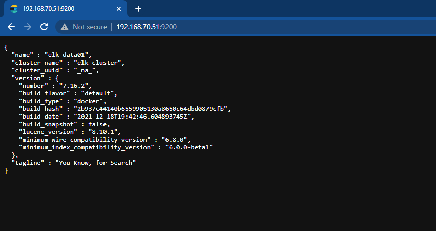

<h1 align="center">Tài liệu xây dựng hệ thống ELK-Stack Cluster cơ bản </h1>

# Phần I. Tổng quan
## 1. Mô hình hệ thống
- Mô hình luồng xử lý dữ liệu


<h3 align="center"></h3>


- Mô hình triển khai
<h3 align="center"></h3>

- Đối với mô hình nêu trên cần đến 7 server sử dụng docker để thực hiện cài đặt cụm ELK cluster, Túy thuộc vào tài nguyên hệ thống mà có thể đặt các role hoặc tăng giảm số container  cho các node thuộc Cluster nhằm mục đích giảm thiếu hoặc tăng số lượng server:
- Quý tắc đăt roles cho cụm:
  - Tối thiểu 1 cụm cần có 3 thành phần: Master, Data, client
  -  Node master: Có trách nhiệm quản lý, tạo, sửa, xóa index, tái sắp xếp shard, thêm hoặc xóa 1 node ra khỏi cụm cluster. Thường được đặt các roles: master, voting_only
  - Node data: Chỉ có trách nhiệm lưu trữ dữ liệu được gửi về. Thường được đặt các roles liên quan đến data
  - Node Client: Có nhiệm xử lý dữ liệu, tiến trình hay chuyển đổi dữ liệu elasticseach hay API
  - Dữ liệu chỉ được phép lưu trữ trên các node data

## 2. Thành phần chức năng các node có trong mô hình
- Node 1:
  - Hosname: elk-master01
  - 
| <p align="center">Node</p> | <p align="center">Host name</p> | <p align="center">role</p> | <p align="center">Cấu hình</p> | <p align="center">Vai trò</p> |
|------|-----------|------|----------|-----------|
| Master-01 | ELK-Master | <ul><li>master</li><li>voting_only</li></ul> | <ul><li></li></ul> | <ul><li>Có trách nhiệm quản lý, tạo, sửa, xóa index, tái sắp xếp shard, thêm hoặc xóa 1 node ra khỏi cụm cluster</li><li>Chỉ định nút có đủ điều kiệu lên làm master trong cụm cluster đã được khai báo </li></ul> |
| Data1 | ELK-Data1 | <ul><li>data_hot</li><li>data_content<li>master</li></ul> | <ul><li></li></ul> | <ul><li>Sử dụng để lưu trữ dữ liệu vửa được đẩy vào từ logstash và có lượng tìm kiếm lớn</li><li>Sử dụng backup dự phòng cho node master </li></ul> ||  |
| Data2 | ELK-Data2 | <ul><li>data_warm</li><li>data_cold</li><li>data_frozen<li>master</li></ul>| <ul><li> </li></ul> | <ul><li>Lưu trữ dữ liệu ít được tìm kiếm</li><li>Sử dụng backup dự phòng cho node master </li></ul> |
| Ingest | ELK-Ingest | <ul><li>Ingest</li></ul> | <ul><li></li></ul> | <ul><li> Xử lý dữ documents trước khi quán trình index bắt đầu  </li></ul> |
| Coordinating | ELK-Coordinating | <ul><li>[ ]</li></ul> | <ul><li></li></ul> | <ul><li>Có trach nhiệm điều phối, xử lý các request</li></ul> |
| Transform | ELK-Transform  | <ul><li>transform</li><li>remote_cluster_client</li></ul> | <ul><li></li></ul> | <ul><li>thực hiện chuyển đổi các chỉ số Elasticsearch và các chỉ số API </li></ul> |
| Machine-learning | ELK-Machine-learning | <ul><li>ml</li><li>remote_cluster_client</li></ul>| <ul><li></li></ul> | <ul><li>Xử lý các tiến trình API requests</li></ul>|


# Phần II. Triển khai cài đặt
### Thực hiện cài đặt Docker Compose trên tất cả node thuộc hệ thống
- Thực hiện update OS:
```sh
sudo apt-get update -y
```
- Cài đặt các gói ràng buộc
```sh
sudo apt-get install -y apt-transport-https ca-certificates curl software-properties-common
```
- Adding Docker’s GPG Key

```sh
curl -fsSL https://download.docker.com/linux/ubuntu/gpg | sudo apt-key add -
```

- Cài đặt Docker
```sh
sudo add-apt-repository "deb [arch=amd64] https://download.docker.com/linux/ubuntu  $(lsb_release -cs)  stable"
sudo apt update
sudo apt-get install docker-ce -y
```
- Kiểm tra version docker cài đặt:
```sh
docker --version
kết quả:
Docker version 20.10.16, build aa7e414
```
- Cài đặt Docker Compose
```sh
apt-get install docker-compose -y
```
- kiểm tra version docker compose sẽ thực hiện cài đặt
```sh
$ apt-cache madison docker-compose-plugin
docker-compose-plugin | 2.5.0~ubuntu-focal | https://download.docker.com/linux/ubuntu focal/stable amd64 Packages
docker-compose-plugin | 2.3.3~ubuntu-focal | https://download.docker.com/linux/ubuntu focal/stable amd64 Packages
```
- cài đặt docker compose version 2.5.0
```sh
sudo apt-get install docker-compose-plugin=2.5.0~ubuntu-focal
```
- Kiểm tra phiên bản docker compose sau khi cài đặt
```sh
$  docker compose version
Docker Compose version v2.5.0
```
## 1. Cài đặt chung trên tất cả các node ELK-Cluster
### Điểu chỉnh bộ nhớ ảo
Điều chỉnh số lượng mmap để tránh trường hợp hết bộ nhớ ảo
- cập nhật thông số trong file: `/etc/sysctl.conf`
```sh
echo "vm.max_map_count=262144" >> /etc/sysctl.conf
```
- kiểm tra lại:
```sh
sysctl -p
```

### Tăng giới hạn mô tả file đang mở
- Thay đổi giá trị trong file `/etc/security/limits.conf`
```sh
echo "- nofile 65536" >> /etc/security/limits.conf
```
### Cập nhật thông tin các node trong file host
```sh
echo "# list IP Private multi-node ELK-cluster
10.10.10.10 elk-master
10.10.10.11 elk-data01
10.10.10.12 elk-data02
10.10.10.13 elk-data03
10.10.10.14 elk-cordinating01
10.10.10.15 elk-cordinating02
10.10.10.16 elk-cordinating03
" >> /etc/hosts
```

### - Allow Port firewalld

```sh
sudo ufw allow 9200
sudo ufw allow 9300
```
## 2. Thực hiện trên từng node ELK-Cluster
### **`2.1 Node elk-master`**

### Bước 1: Tạo thư mục lưu trữ dữ liệu

- Tạo và phân quyền thư mục lưu trữ data và logs
```sh
mkdir -p /elk-masterdb/ /elk-masterdb/data/ /elk-masterdb/logs/
chown -R 1000:1000 /elk-masterdb/
chown -R 1000:1000 /elk-masterdb/data/
chown -R 1000:1000 /elk-masterdb/logs/
```

### Bước 2: Tạo các file cấu hình hỗ trợ cài đặt

- Tạo thư mục setup và lưu trữ file config
```sh
mkdir -p /elk-cluster-setup && cd /elk-cluster-setup
```
- Tạo file config `elasticsearch-elk-master.yml` sử dụng cho elasticsearch nội dung [tại đây]()

- Tạo file setup `docker-compose.yml` nội dung [tại đây]()

### Bước 3: Setup và kiểm tra

- chạy lệnh setup
```sh
docker compose up -d
```
Bước 4: kiểm tra kết quả:

<h3 align="center"></h3>


### **`2.2 Node elk-data01`**
### Bước 1: Tạo thư mục lưu trữ dữ liệu

- Tạo và phân quyền thư mục lưu trữ data và logs
```sh
mkdir -p /elk-data01/ /elk-data01/data/ /elk-data01/logs/
chown -R 1000:1000 /elk-data01/
chown -R 1000:1000 /elk-data01/data/
chown -R 1000:1000 /elk-data01/logs/
```
### Bước 2: Tạo các file cấu hình hỗ trợ cài đặt

- Tạo thư mục setup và lưu trữ file config
```sh
mkdir -p /elk-cluster-setup && cd /elk-cluster-setup
```
- Tạo file config `elasticsearch-elk-data01.yml` sử dụng cho elasticsearch nội dung [tại đây]()

- Tạo file setup `docker-compose.yml` nội dung [tại đây]()

### Bước 3: Setup và kiểm tra

- chạy lệnh setup
```sh
docker compose up -d
```
Bước 4: kiểm tra kết quả:

<h3 align="center"></h3>

### **`2.3 Node elk-data02`**
### Bước 1: Tạo thư mục lưu trữ dữ liệu

- Tạo và phân quyền thư mục lưu trữ data và logs
```sh
mkdir -p /elk-data02/ /elk-data02/data/ /elk-data02/logs/
chown -R 1000:1000 /elk-data02/
chown -R 1000:1000 /elk-data02/data/
chown -R 1000:1000 /elk-data02/logs/
```
### Bước 2: Tạo các file cấu hình hỗ trợ cài đặt

- Tạo thư mục setup và lưu trữ file config
```sh
mkdir -p /elk-cluster-setup && cd /elk-cluster-setup
```
- Tạo file config `elasticsearch-elk-data02.yml` sử dụng cho elasticsearch nội dung [tại đây]()

- Tạo file setup `docker-compose.yml` nội dung [tại đây]()

### Bước 3: Setup và kiểm tra

- chạy lệnh setup
```sh
docker compose up -d
```
Bước 4: kiểm tra kết quả:

<h3 align="center"></h3>

### **`2.4 Node elk-data03`**
- Tạo và phân quyền thư mục lưu trữ data và logs
```sh
mkdir -p /elk-data03/ /elk-data03/data/ /elk-data03/logs/
chown -R 1000:1000 /elk-data03/
chown -R 1000:1000 /elk-data03/data/
chown -R 1000:1000 /elk-data03/logs/
```
### Bước 2: Tạo các file cấu hình hỗ trợ cài đặt

- Tạo thư mục setup và lưu trữ file config
```sh
mkdir -p /elk-cluster-setup && cd /elk-cluster-setup
```
- Tạo file config `elasticsearch-elk-data03.yml` sử dụng cho elasticsearch nội dung [tại đây]()

- Tạo file setup `docker-compose.yml` nội dung [tại đây]()

### Bước 3: Setup và kiểm tra

- chạy lệnh setup
```sh
docker compose up -d
```
Bước 4: kiểm tra kết quả:

<h3 align="center"></h3>

### **`2.4 Node elk-service01`**

- Tạo và phân quyền thư mục lưu trữ data và logs sử dụng cho `ELK-coordinating01`
```sh
mkdir -p /elk-coordinating01/ /elk-coordinating01/data/ /elk-coordinating01/logs/
chown -R 1000:1000 /elk-coordinating01/
chown -R 1000:1000 /elk-coordinating01/data/
chown -R 1000:1000 /elk-coordinating01/logs/
```

### Bước 2: Tạo các file cấu hình hỗ trợ cài đặt

- Tạo thư mục setup và lưu trữ file config
```sh
mkdir -p /elk-cluster-setup && cd /elk-cluster-setup
```
**`elk-coordinating01`**
- Tạo file config `elasticsearch-elk-coordinating01.yml` sử dụng cho elasticsearch nội dung [tại đây]()

**`elk-kibana01`**

- Tạo file config `elk-kibana01.yml`. Kibana sẽ trỏ vào Cụm Elasticsearch để đọc dữ liệu thông qua IP VIP được cấu hình để chạy HA cho 3 node `coordinating`
  - Nội dung file config [tại đây]()

**`elk-logstash01`**
- Tạo thư mục lưu trữ file config và file pipeline xử lý dữ liệu logs đẩy về
```sh
mkdir -p logstash 
mkdir -p logstash/config 
mkdir -p logstash/pipeline 
```
- Tạo file config `logstash.yml`: 
```sh
# vi logstash/config/logstash.yml
- Nội dung:
---
## Default Logstash configuration from Logstash base image.
## https://github.com/elastic/logstash/blob/master/docker/data/logstash/config/logstash-full.yml
#
http.host: "0.0.0.0"
path.config: /usr/share/logstash/pipeline
```

- Tạo file pipeline trỏ vào server `redis-cache` để lấy dữ liệu và sau khi xử lý dữ liệu sẽ trả dữ liệu về cụm `Elasticsearch` 

- Nội dung file [tại đây]()

> Lưu ý: Pipeline sử dụng `IP-VIP` để trỏ đến các cụm redis và elasticsearch


**`keepalived-haproxy01`**

- Container này sử dụng để khởi tạo IP VIP và xử lý HA cho các hệ thống Redis-cache cũng như ELk-CLuster
- Tạo thư mục lưu trữ file cấu hình `keepalived.conf` và `haproxy.cfg`, nội dung file config [tại đây]()
```sh
mkdir -p keepalived-haproxy/ keepalived-haproxy/keepalived keepalived-haproxy/haproxy
```


### Bước 3: Mở port firewall

```sh
sudo ufw allow 9200 
sudo ufw allow 9300
sudo ufw allow 9201  
sudo ufw allow 6370  
sudo ufw allow 8080  
sudo ufw allow 5001  
```


### Bước 3: Setup và kiểm tra

- chạy lệnh setup
```sh
docker compose up -d
```
Bước 4: kiểm tra kết quả:

```sh
root@elk-service01:/elk-cluster-setup# docker ps -a
CONTAINER ID   IMAGE                                                  COMMAND                  CREATED              STATUS              PORTS     NAMES
ac233b60b956   docker.elastic.co/kibana/kibana:7.16.2                 "/bin/tini -- /usr/l…"   About a minute ago   Up About a minute             elk-kibana01
3a6ca578d0c4   docker.elastic.co/elasticsearch/elasticsearch:7.16.2   "/bin/tini -- /usr/l…"   About a minute ago   Up About a minute             elk-coordinating01
86871b607c91   pelin/haproxy-keepalived:v1.0.0                        "/haproxy-keepalived"    About a minute ago   Up About a minute             keepalived-haproxy01
82b1923282aa   docker.elastic.co/logstash/logstash:7.16.2             "/usr/local/bin/dock…"   About a minute ago   Up About a minute             elk-logstash01
root@elk-service01:/elk-cluster-setup#
```
### **`2.5 Node elk-service02`**

- Thực hiện tương tự node `elk-service01` và cần thay đổi các trường thông tin sau:
  - Tên các container hoạt động trên docker
  - thay đổi địa chỉ IP của container đó trong các file cấu hình .yml
  - thay đổi mode master và backup trong file cấu hình IP VIP

- Nội dung file setup và config đặt [tại đây]()

### **`2.6 Node elk-service03`**

- Các thao tác thực hiện tương tự node `elk-service02`

- Nội dung file setup và config đặt [tại đây]()


### **`2.7 redis-cluster01`**

### Bước 1: Tạo thư mục lưu trữ dữ liệu
- Tạo thư mục lưu trữ dữ liệu và file cấu hình
```sh
mkdir -p /redis-cache01/ /redis-cache01/data /redis-cache01/conf
sudo chown -R 1001:1001 /redis-cache01
```

### Bước 2: Tạo thư mục cài đặt
- tạo và truy cập thư mục setup
```sh
mkdir -p /elk-cluster-setup && cd /elk-cluster-setup
```
- Tạo file config redis cluster
```sh
#vi redis.conf
- nội dung:
port 6379
protected-mode no
daemonize no
appendonly yes
cluster-enabled yes
cluster-config-file nodes.conf
cluster-node-timeout 5000
cluster-announce-ip 10.10.10.17  //IP node 
cluster-announce-port 6379
cluster-announce-bus-port 16379
```
- Tạo đường dẫn chưa các file pipeline cho logstash
```sh
mkdir -p logtash/pipeline
```
- Tạo  1 file pipeline `01-bests.conf` để xử lý dữ liệu có nội dung sau:
```sh
input {
  beats {
    port => 5000
  }
}
filter {
  if [type] == "syslog" {
    grok {
      match => { "message" => "%{SYSLOGTIMESTAMP:syslog_timestamp} 
%{SYSLOGHOST:syslog_hostname} 
%{DATA:syslog_program}(?:\[%{POSINT:syslog_pid}\])?: 
%{GREEDYDATA:syslog_message}" }
      add_field => [ "received_at", "%{@timestamp}" ]
      add_field => [ "received_from", "%{host}" ]
      add_field => [ "index_es", "%{[@metadata][beat]}" ]
      add_field => [ "type_es", "%{[@metadata][type]}" ]
    }
    syslog_pri { }
    date {
    match => [ "syslog_timestamp", "MMM d HH:mm:ss", "MMM dd HH:mm:ss" ]
    } 
  }
}
output {
  redis {
    host => ["IPVIP-local"]
    port => 6370
    data_type => "list"
    key => "logstash"
   }
}
```

- Tạo file setup `docker-compose.yml` nội dung [tại đây]()


- chạy lệnh setup
```sh
docker compose up -d
```
### Bước 3: Mở port firewall

```sh
sudo ufw allow 6379 
sudo ufw allow 6370  
sudo ufw allow 5001
sudo ufw allow 5000
```

### **`Sau khi hoàn thành tiếp tục thực hiện tương tự đối với 2 node cluster redis-cluster02 và redis-cluster03`**

- Nội dung file setup và config node `redis-cluster02` [tại đây]()
- Nội dung file setup và config node `redis-cluster03` [tại đây]()


### Truy cập node `redis-cluster01` thực hiện add cụm cluster cho 3 node vừa cài đặt

- thực hiện các lệnh sau:
```sh
docker exec -it redis-cluster01 bash
cd /usr/local/bin
redis-cli --cluster create 10.10.10.17:6379 10.10.10.18:6379 10.10.10.19:6379
```
- kết quả:
```sh
>>> Performing Cluster Check (using node 10.10.10.17:6379)
M: 72b91b2ee3e93b5d19b33232a097fc059ea8ab04 10.10.10.17:6379
   slots:[0-5460] (5461 slots) master
M: fdcff584aaa53203e5c488a4e808cf84f0204f8d 10.10.10.19:6379
   slots:[10923-16383] (5461 slots) master
M: d6041a7b01c46e6129737655c41c029c2667f3a3 10.10.10.18:6379
   slots:[5461-10922] (5462 slots) master
[OK] All nodes agree about slots configuration.
>>> Check for open slots...
>>> Check slots coverage...
[OK] All 16384 slots covered.
root@redis01:/usr/local/bin#
```
- Để có 1 cụm redis cluster cần có ít nhất và node và trong trường hợp các node master cần có các bản replicas thì cần ít nhất là 6 node tương ứng 3 slave cho 3 master